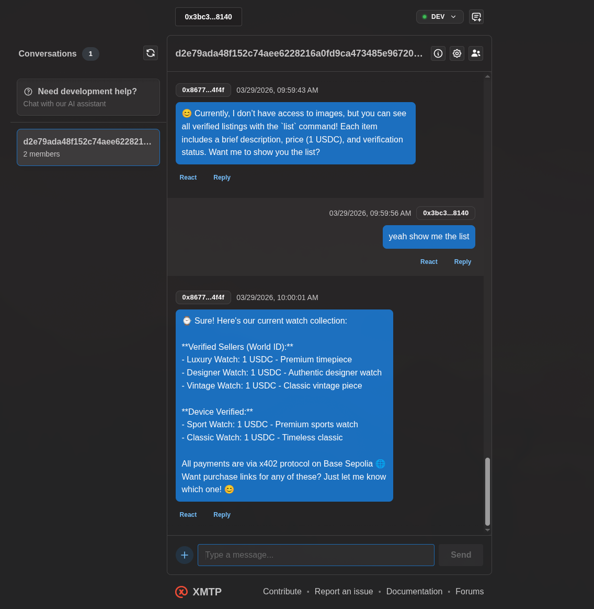
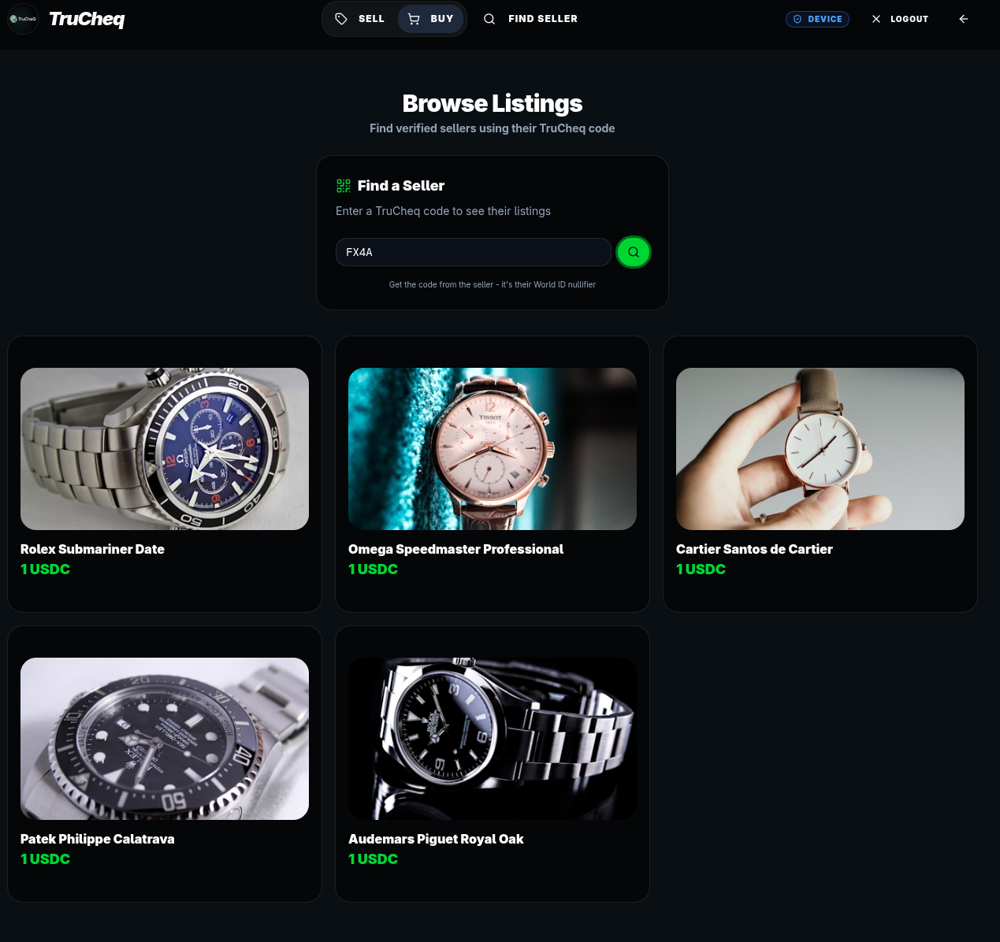

# TruCheq

[](https://github.com/open-biz/truecheq/commits/main)
[](https://github.com/open-biz/truecheq)
[](https://opensource.org/licenses/MIT)
[](https://bun.sh)
[](https://nextjs.org)
[](https://www.typescriptlang.org)
[](https://tailwindcss.com)
[](https://worldcoin.org)
[](https://xmtp.org)
[](https://base.org)
[](https://docs.cdp.coinbase.com/x402)

> [!NOTE]
> This file is synced with `SKILL.md`. Edits to one will be reflected in the other.

<!-- SKILL_CONTENT_START -->
# TruCheq - Web3 P2P Commerce Protocol

A headless Web3 P2P commerce protocol for social platforms (Reddit, Discord, Twitter). Sellers verify identity via World ID, create IPFS-hosted listings, share links, and buyers chat via XMTP and pay via Coinbase x402 on Base. No database — all state lives on IPFS.

## Tech Stack

- **Framework:** Next.js 16, React 19, TypeScript
- **Package Manager:** bun
- **Styling:** Tailwind CSS v4, shadcn/ui, Framer Motion
- **Wallet:** RainbowKit + wagmi + viem
- **Identity:** World ID (IDKit) — `@worldcoin/idkit`
- **Messaging:** XMTP V3 — encrypted buyer↔seller chat via `@xmtp/browser-sdk`
- **Payments:** Coinbase x402 (`x402-next`, `@coinbase/x402`) on Base Sepolia
- **Storage:** Filebase (IPFS) for metadata & images
- **Agent:** `@xmtp/agent-sdk` for AI seller agent

## Commands

```bash
bun install          # Install dependencies
bun dev              # Dev server (Next.js)
bun build            # Production build
bun run agent        # Start XMTP AI agent
bun lint             # ESLint
```

## Key Directories

- `src/app/` — Next.js App Router pages & API routes
- `src/app/api/deal/[id]/` — Listing API (read from IPFS)
- `src/app/api/deal/[id]/x402/` — x402 payment-gated API endpoint (for agents)
- `src/app/api/verify/` — World ID proof verification
- `src/app/api/rp-signature/` — World ID RP signature generation
- `src/app/api/upload/` — IPFS upload via Filebase
- `src/app/pay/[id]/` — x402 paywall-protected payment confirmation page
- `src/components/` — React components
- `src/components/ui/` — shadcn/ui primitives
- `src/lib/` — Utilities (chains, filebase, wagmi config, utils)
- `src/lib/xmtp-agent.ts` — XMTP AI agent for seller
- `src/proxy.ts` — x402 payment proxy (protects /pay/* routes)

## Key Components

- `WorldIDAuth` — World ID sign-in/sign-up with IDKit (Orb & Device)
- `WorldIDOnboarding` — Initial World ID setup flow
- `DealCreator` — Create listing form → IPFS upload
- `DealDashboard` — Seller's listing management (view)
- `DealGate` — Buyer-facing listing page with verification badge, x402 payment, XMTP chat
- `XMTPChat` — Embedded XMTP V3 chat using `@xmtp/browser-sdk`
- `XMTPChat` requires wallet connection before rendering (use `useAccount` to check)
- `LandingPage` — Marketing page with features, demo, use cases

## Path Aliases

- `@/*` maps to `./src/*` (tsconfig paths)

## Important Conventions

- App Router (not Pages Router) — layouts in `layout.tsx`, pages in `page.tsx`
- Components use `'use client'` directive where needed
- UI components from shadcn/ui in `src/components/ui/`
- Tailwind v4 with `@tailwindcss/postcss` plugin
- React Compiler enabled (`reactCompiler: true` in next.config.ts)
- Environment variables in `.env.local` (not committed)

## XMTP Integration

### Frontend (Browser SDK)

The frontend uses `@xmtp/browser-sdk` for V3:

```typescript
import { Client } from '@xmtp/browser-sdk';
import { useWalletClient, useAccount } from 'wagmi';

// Create signer from wagmi walletClient (avoid ethers BrowserProvider)
const eoaSigner = {
  type: 'EOA' as const,
  getIdentifier: async () => ({
    identifierKind: 1,
    identifier: walletAddress.toLowerCase()
  } as any),
  signMessage: async (message: string): Promise<Uint8Array> => {
    const sig = await walletClient.signMessage({ message });
    const sigHex = sig.slice(2);
    return new Uint8Array(sigHex.match(/.{1,2}/g)?.map(byte => parseInt(byte, 16)) || []);
  }
};

const client = await Client.create(eoaSigner, { env: 'dev' });
```

### Agent (Agent SDK)

The seller agent uses `@xmtp/agent-sdk`:

```typescript
import { Agent, createSigner, createUser } from '@xmtp/agent-sdk';

const user = createUser(privateKey);
const signer = createSigner(user);
const agent = await Agent.create(signer, { env: 'dev' });

agent.on('text', async (ctx) => {
  await ctx.sendTextReply('Response');
});

await agent.start();
```

## Environment Variables

```
NEXT_PUBLIC_WLD_APP_ID       # World ID app ID (from developer.worldcoin.org)
WORLD_PRIVATE_KEY            # World ID RP signing key
NEXT_PUBLIC_X402_PAY_TO      # Wallet address to receive x402 payments
NEXT_PUBLIC_XMTP_ENV         # XMTP environment: 'dev' (default) or 'production'
XMTP_WALLET_KEY              # Private key for XMTP agent
XMTP_DB_ENCRYPTION_KEY       # Encryption key for agent database
FILEBASE_ACCESS_KEY          # Filebase IPFS access
FILEBASE_SECRET_KEY          # Filebase IPFS secret
NEXT_PUBLIC_FILEBASE_BUCKET  # Filebase bucket name
NEXT_PUBLIC_FILEBASE_GATEWAY # Filebase gateway URL
```

## x402 Payment Integration

- **Page paywall:** `src/proxy.ts` protects `/pay/*` routes with x402 payment requirement
- **Agent API:** `src/app/api/deal/[id]/x402/route.ts` uses `withX402` for programmatic agent purchases
- **Testnet:** Uses default x402.org facilitator (no CDP credentials needed for base-sepolia)
- **Mainnet:** Requires `CDP_API_KEY_ID` and `CDP_API_KEY_SECRET` with `@coinbase/x402` facilitator

## Common Tasks

### Adding a new UI component
1. Use existing shadcn/ui components from `src/components/ui/`
2. Follow the naming and structure conventions
3. Use Tailwind for styling

### Creating a new API route
1. Add route file in `src/app/api/[endpoint]/route.ts`
2. Use standard Next.js App Router conventions
3. Handle errors gracefully

### Testing XMTP chat
1. Ensure wallet is connected (XMTPChat only renders when `isConnected`)
2. Check browser console for `[XMTP V3]` logs
3. Agent must be running: `bun run agent`

### Fixing XMTP connection issues
1. Check that wallet is connected first
2. Verify agent is running with `ps aux | grep agent`
3. Check agent logs for errors
4. Ensure both use same XMTP network (dev vs production)
5. Clear old XMTP databases: `rm -f xmtp-dev-*.db3*`

<!-- SKILL_CONTENT_END -->

---

# 🛡️ TruCheq: Headless Web3 Commerce Protocol

### The Buy Button for your DMs

**Built for the World Chain × XMTP × Coinbase Hackathon**

---

## 🧭 Overview

TruCheq is a **sybil-resistant P2P commerce protocol** for social platforms like Reddit, Discord, and Twitter. It turns any chat thread into a verifiable storefront — no marketplace, no database, no middlemen.

It combines three hackathon primitives into one seamless flow:

- **World ID (IDKit)** — Seller identity verification. Orb-verified = trusted human. Device-verified = basic trust.
- **XMTP** — End-to-end encrypted buyer↔seller chat embedded directly on listing pages.
- **Coinbase x402** — Payment settlement on Base.

---

## ⚙️ How It Works

1. **Verify** — Seller signs in with World ID → receives an Orb or Device verification badge.
2. **List** — Seller creates a listing → images & metadata upload to IPFS (Filebase).
3. **Share** — A unique link is generated → seller posts it on Reddit / Discord / Twitter.
4. **Browse** — Buyer clicks the link → sees the listing with the seller's verification status and trust level.
5. **Chat** — Buyer negotiates with the seller's AI agent via XMTP (encrypted).
6. **Pay** — Payment settles via Coinbase x402 on Base.

---

## 🏗️ Tech Stack

| Layer | Technology |
|---|---|
| Framework | Next.js 15, React 19, TypeScript |
| Identity | World ID (IDKit) — Orb & Device verification |
| Messaging | XMTP — encrypted buyer↔seller chat |
| Payments | Coinbase x402 protocol on Base |
| Storage | Filebase (IPFS) for metadata & images |
| Wallet | RainbowKit + wagmi + viem |
| UI | Tailwind CSS, shadcn/ui, Framer Motion |

---

## 🔄 Architecture (No Smart Contract)

**Current:** Listings are stored entirely in IPFS. No gas fees for sellers.

```
Seller → Upload metadata to IPFS → Share link directly
Buyer  → View listing from IPFS  → Pay via x402
```

**Future: Adding Escrow**

If you want to add escrow functionality in the future, here are the options:

### Option 1: Smart Contract Escrow
- Deploy a contract that holds buyer funds until delivery confirmed
- Seller calls `createListing()` (pays gas)
- Buyer deposits USDC to contract
- Seller confirms shipment → buyer confirms receipt → funds released
- Dispute resolution: either party can initiate, escalation to arbitrator

### Option 2: x402 Escrow Hold
- Use x402's built-in features to hold payment
- Both parties must confirm completion
- Funds released only when buyer confirms "received"

### Option 3: Third-Party Escrow Service
- Integrate with existing escrow providers
- More complex but proven dispute resolution

### Option 4: Reputation-Based (No Escrow)
- World ID verification as trust signal
- XMTP chat for negotiation
- Assume good faith + reputation scoring
- Currently implemented ✓

---

## 🚀 Getting Started

```bash
# Install dependencies
bun install

# Run development server
bun dev
```

---

## 🔑 Environment Variables

Create a `.env.local` file in the project root:

```env
# World ID
NEXT_PUBLIC_WLD_APP_ID=app_staging_...

# Coinbase x402 — wallet to receive payments
NEXT_PUBLIC_X402_PAY_TO=0x...

# Filebase (IPFS)
FILEBASE_ACCESS_KEY=your_access_key
FILEBASE_SECRET_KEY=your_secret_key
NEXT_PUBLIC_FILEBASE_BUCKET=trucheq
NEXT_PUBLIC_FILEBASE_GATEWAY=your_gateway.myfilebase.com

# Coinbase CDP (optional, for agent payments)
CDP_API_KEY_ID=...
CDP_API_KEY_SECRET=...
```

---

## ✅ Hackathon Qualification

| Track | Integration | Status |
|---|---|---|
| **World ID** | IDKit — Orb & Device seller verification | ✅ |
| **XMTP** | Encrypted buyer↔seller chat on listing pages | ✅ |
| **Coinbase x402** | Payment settlement on Base | ✅ |
| **No Gas for Sellers** | IPFS-only listings (no smart contract) | ✅ |

---

## 📐 Architecture

```
Seller                              Buyer / Agent
  │                                   │
  ├─ World ID verify ──────────┐      │
  ├─ Upload to IPFS (Filebase) │      │
  │                             ▼      │
  │                      TruCheq Link  │
  │                             │      │
  │                             ├──────┤
  │                             │  View listing from IPFS
  │                             │  World ID verification badge
  │                             │  Chat via XMTP
  │                             │  Pay via x402
  │                             ▼
  └──────────── Settlement on Base ────┘
```

---

## 📸 Demo Screenshots

### Screenshot 1: Agent Interface for Sellers vs Buyers


### Screenshot 2: World ID + CDP x402 


---

<p align="center"><b>TruCheq</b> — Trust in a link.</p>
